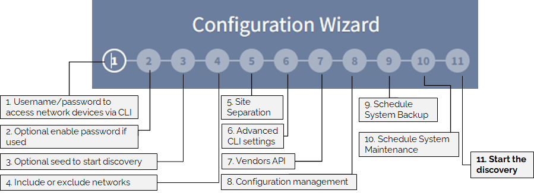
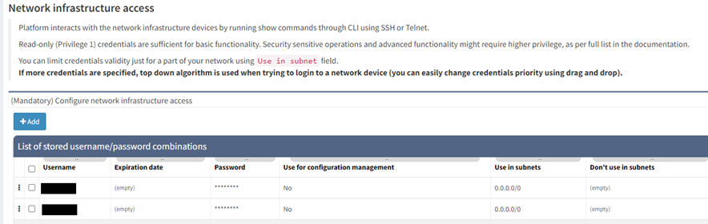
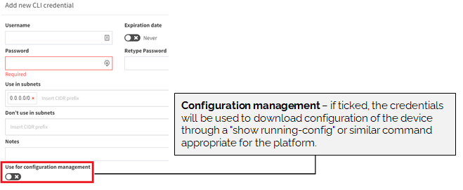
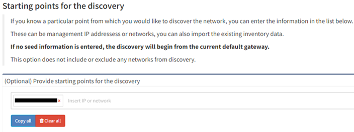
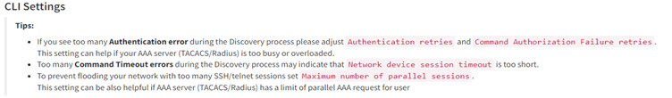
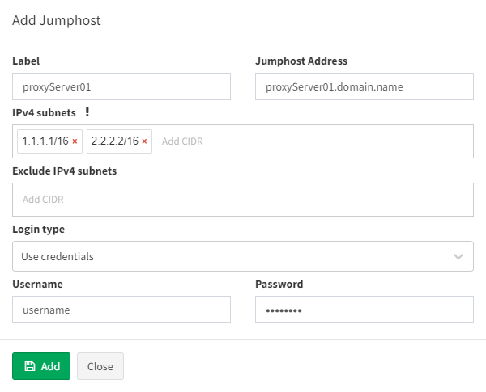

# Configuration Wizard

After login in for the first time, you will be presented with the Configuration Wizard. This will guide you throughout the initial setup, in order to start the first discovery.



## 01 -- Configure Credentials

Network infrastructure credentials are stored in **Settings → Authentication**. These credentials use IP Fabric to access the CLI of the network devices. Read-only (privilege level 1) credentials are sufficient for the discovery.



If credentials are provided for configuration changes tracking and saved configuration consistency (i.e. they allow commands such as `show run` and `show start`), mark this set of credentials using the checkbox [Use for configuration management](Configuration).



You can limit the validity of the credentials just for a part of your network by **Use in subnet** field. If more credentials are specified, a top-down algorithm is used when trying to login into a network device or the credentials priority can be changed using drag and drop.


## 02 -- Enable mode passwords (optional)

Those credentials are stored in **Settings → Authentication**. Privileged credentials are generally only necessary for configuration management. However, some platforms require privileged credentials to access basic network state information, such as MST spanning-tree state or 802.1X session information.

!!! note

    If enable mode is configured with no password and is needed for discovery, **any enabled password information needs to be set!** Otherwise, IP Fabric **won’t even try the enable command**.


!!! warning

    Please **be careful** to configure enable password only for devices (subnets) that **need the enable command to be included**.  We encountered some problems with Cisco ISE. When an incorrect enable password was entered, the user account was locked and IP Fabric wasn't able to finish the discovery for those devices.

## 03 -- Starting point for the discovery (optional)

If you know a particular starting point for discovering the network, the information can be entered at **Settings → Discovery Seed**. This option does not exclude any networks from discovery (for this option see next step).

The starting points can be management IP addresses or networks, or existing inventory data can also be imported.

If no seed information is entered, the discovery will begin from the current default gateway. The system will try to trace `RFC6890` subnets (by default) to determine the immediate next hops to log in to.



## 04 -- Include or Exclude networks in Discovery

By default, there are no limitations on discovery, and all IP addresses are allowed (i.e. *Include scope* is `0.0.0.0/0`).

Discovery can be limited to one or more subnets using **Settings → Advanced → Discovery → IP Scope → IP networks to include in discovery and analysis**. Enter one or more subnets to limit the discovery process to addresses from particular networks.

Specific parts of the network can be also excluded from discovery using **Settings → Advanced → Discovery →  IP Scope → IP networks to exclude from discovery and analysis**.


IP Scope settings are not applied to Vendor API (everything is downloaded and used in discovery).

Exclude option takes precedence over include. For example

- IP networks to include in discovery and analysis: `10.0.0.0/8`
- IP networks to exclude from discovery and analysis: `10.24.0.0/16`

Results in `10.0.0.0/8` being scanned excluding `10.24.0.0/16` subnet.

## 05 -- Site Separation

The site represents a separate collection of devices. A site can be a branch, a factory, a production floor, a campus, or anything that might represent a logical group for a user.

By default, the Site distribution is generated automatically after the discovery process ends and is based on the rules described below. It can also be triggered manually without the need for the whole discovery process by going to **Settings → Advanced → Discovery → Site separation** (in global or Snapshot settings).

### Routing and switching domain

!!! note

    With this setting, you can manually edit the distribution of sites later. Sites can be also renamed.

By default, the site is comprised of the topology of all contiguously interconnected protocols, and the boundary of a site is formed by the network protocol relation that is not under management using the provided authentication credentials. The default separation is useful for MPLS networks where directly connected routing infrastructure at the site’s edge is not accessible. For situations where an inaccessible routed firewall is used at the site (i.e. device under different management team), an option **Firewall at site** can be turned on so the infrastructure before and behind the firewall is not separated into two different sites.

For networks that have direct routing connectivity between sites, such as DMVPN or Leased Lines (usually over Serial or MFR interfaces), an option to separate the site using **tunnel** and/or **serial** the interface should be selected.

For configuration go to **Settings → Advanced → Discovery → Site separation**.


### Regular expression on `hostname`

!!! note

    Site distribution cannot be changed manually when regex rules are used. Sites cannot be renamed.

Alternatively, site separation can follow a specific Regular Expression (RegEx) where separation will be performed based on portion of a device `hostname`.

Go to **Settings → Advanced → Discovery → Site separation** and change **Site boundary calculation** to **RegEx based on `hostname`**.

**Transform `hostname`** is used to normalize site names based on hostname:

- Upper case (default) -- having first hostname `PRAGUE-RTR1` and second hostname `prague-rtr2`, results in having both devices at one site named `PRAGUE`.

- Lower case -- having first hostname `PRAGUE-RTR1` and second hostname `prague-rtr2`, results in having both devices at one site named `prague`.

- No transformation -- having first hostname `PRAGUE-RTR1` and second hostname `prague-rtr2`, results in having every device located in its own site named `PRAGUE` and `prague` respectively.

In the last step, introduce the **Regular Expression**. Use [regex101](https://regex101.com/) for validation and parentheses to extract the site from the `hostname` correctly.

!!! hint

    If you cannot cover the names of the sites with one regex, you can use logical **or**. Use `|` (pipe) between RegEx rules.

The change in the regex is displayed as a live preview. Once the regex is ready, click **Site overview with this RegEx** and
observe results. Click **Save** (in the upper right corner).


!!! example

    We have several locations whose name is logically designed as one letter with one to three numbers. From the point of view of a regex, such a site can generally be expressed as `^(\[a-zA-Z\]\\d{1,3})`. Unfortunately, we have two other sites that do not fit into this schema. These sites can be defined with their own regex and this can be added to the original one using the logical operator **or**:

    ```
    ^([a-zA-Z\]\d{1,3}|HWLAB|static\d{1})
    ```

    to combine these 3 separate options together.

For devices that do not match the RegEx, IP Fabric automatically adds those to the site based on protocol relation (CDP, LLDP, STP, L3) under the condition that there's only a single relation to one particular site. This feature is especially useful for Access Points and similar devices, that do not follow the standard naming conventions and are linked to one specific location.

### Manual Site Separation

!!! note

    With this setting, you can manually edit the distribution of sites.

The Manual Site Separation option is complementary to two previous options and provides the users with full flexibility. It can be enabled in **Inventory > Sites > Manual Separation** where any device's site can be adjusted based on more attributes.

## 06 - CLI Settings



### Fine-Tune SSH/telnet CLI parameters

The IP Fabric's discovery is primarily using Command Line Interface (CLI) to discover network elements. There are certain default CLI parameters that can be found in **Settings → Advanced → SSH/TELNET**:


Network device login timeout
: Timeout before the logging prompt is received. It may take longer for remote branches over low-speed lines, or destined to overloaded devices.

Network device session timeout
: Too many _Command Timeout_ errors during the Discovery process may indicate that _Network device session timeout_ is too short and it may be necessary to expect a delay for a response to arrive.

Maximum number of parallel sessions
: To prevent flooding your network with too many SSH/TELNET sessions set _Maximum number of parallel sessions_. This setting can be also helpful if the AAA server (TACACS/Radius) has a limit of parallel AAA requests for users.

    In rare cases, the Cisco ISE or similar systems may rate limit the command authorization. When there are too many authorization failures and Cisco ISE is in place, try to limit the number of parallel sessions down to 10 and steadily increase.

Basic failure
: How many times to retry a connection for any error, except authentication failure.

Authentication failure
: _Authentication failure_ can occur even if a user is authorized to login but may happen, for example, when an AAA server is overloaded or an authentication packet is lost.

Command Authorization Failure retries
: If you see many examples of *Authentication error* during the Discovery process, please adjust _Authentication failure_ and _Command Authorization Failure retries_.

!!! example "Example of error message in Connectivity Report"

    According to the summary of issues in the very first completed snapshot, the CLI Settings can be adjusted. Here are some of the most common errors and adjustments:

    | Error                                                                           | Error Type                    | How to mitigate                                                                                                    |
    | ------------------------------------------------------------------------------- | ----------------------------- | ------------------------------------------------------------------------------------------------------------------ |
    | connect ETIMEDOUT XX.XX.XX.XX:22                                                | Connection error              | Received no response from the destination.                                                                         |
    | connect ECONNREFUSED XX.XX.XX.XX:22                                             | Connection error              | The connection to the destination is being blocked by an access-list or firewall.                                  |
    | All configured authentication methods failed                                    | Authentication error          | Unable to authenticate to the destination host                                                                     |
    | Authentication failed                                                           | Authentication error          | Unable to authenticate to the destination host                                                                     |
    | Authentication failed - login prompt appeared again                             | Authentication error          | Unable to authenticate to the destination host                                                                     |
    | SSH client not received any data for last 120000 ms! cmd => show vrrp  \| e #^$ | Command timeout               | The command `show vrrp  \| e #^$` timed out. Increase **device session timeout.**                                  |
    | Can't detect prompt                                                             | Command timeout               | Unable to detect CLI prompt. Increase **network device login timeout.**                                            |
    | Command "enable" authorization failed, tried 2x                                 | Command authorization failure | The command wasn't authorized. **Increase command authorization failure retries** or increase the timer value (ms) |

### Jump host

**Jump host** allows to set-up connection to the server which can be used as a **proxy server for discovery** purposes. For connecting, IP Fabric uses the `sshuttle` library that has the [following requirements for the jump host.](https://sshuttle.readthedocs.io/en/stable/requirements.html#client-side-requirements).

!!! warning

    Please bear in mind, that once the connection is established, it will be enabled permanently, until disabled or removed! If there are any network issues, IP Fabric software will try to establish a connection periodically.

!!! warning

    At least one seed IP address has to be provided as a starting point behind Jumphost in seed configuration.

#### Set up Jump host

1.  Open jump host settings, using item **Settings → Advanced → SSH/TELNET**

2.  At the bottom of the page, please select **Add** button

    

3.  Fill in all necessary data

    1.  **Label** - the name for configuration (mandatory)
    2.  **Jump host Address** - IP address of FQDN name (mandatory)
    3.  **IPv4 subnets** - subnet in CIDR representation, allows adding more than open, separated with spaces (mandatory)
    4.  **Exclude IPv4 subnets** - subnet to exclude in CIDR representation, allows to add more than open, separated with spaces (optional)
    5.  **Login type**
        1.  **Use credentials** - require to provide username and password
        2.  **Use SSH keys** - if you copied ssh public key to the proxy server, it won’t require providing a password (please jump to the _SSH key configuration_ section)
    6.  **Username** - Username for authentication (mandatory)
    7.  **Password** - password for authentication (mandatory if ‘Use credentials’ is used)

        

4.  Click **Add**.
5.  If a connection is open, you will see the **Running** status in Jumphost list

    

!!! warning

    If you use 0.0.0.0/0 or another subnet that includes your network from which you are connecting to IP Fabric, make sure you put your network to **“Exclude IPv4 subnet”**. Otherwise, your IP connection will be lost and you will have to recover from the console.

#### SSH key configuration

!!! note

    Adding ssh key to proxy server allows you to avoid using passwords for authentication.

1.  Download ssh key from Jumphost settings

    

2.  Save `ipf-discovery-public-key.pub`

3.  Copy file content to `~/.ssh/authorized_keys` (or equivalent) file of the user that will authenticate with Jumphost server.

4.  If the key has been copied you can use the option **Use SSH keys** while adding a new Jumphost server, instead of **Use credentials**.

#### Disabling Jumphost connection

1.  Edit configuration that needs to be disabled, i.e.

    

2.  Change the setting to **Disabled**,

3.  Click the **Update** button

    

#### Remove Jumphost configuration

1.  On Jumphost servers list, check configuration that needs to be removed

2.  Click **Delete** button

    

#### Limitations

Only TCP connections work through the Jump host. Traceroute with ICMP is not supported so the discovery process might not be able to get over the unreachable part of the network (for example sites separated by the provider’s network). In this case, you will have to add at least one IP from each site to the seeds settings.

### Custom SSH/Telnet ports

Custom SSH/Telnet ports settings enable the discovery process to use different than standard ports for connecting. The standard for SSH is port 22 and 23 for Telnet.

In the following example we will configure the discovery process to use port `8080` for SSH connections towards firewall at `192.168.168.10`:


As a result of such configuration, we would create a new item under the **Custom SSH/Telnet ports** configuration, which will be applied to every new snapshot created by IP Fabric.


